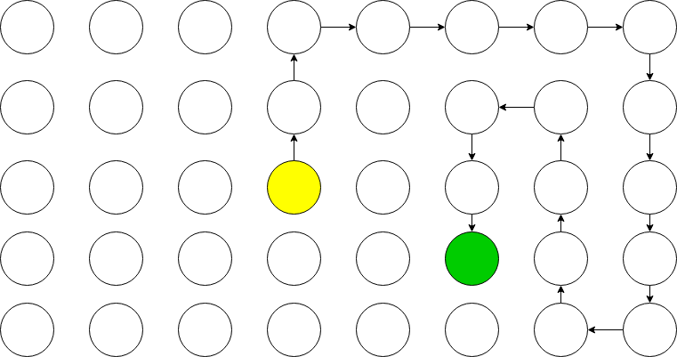
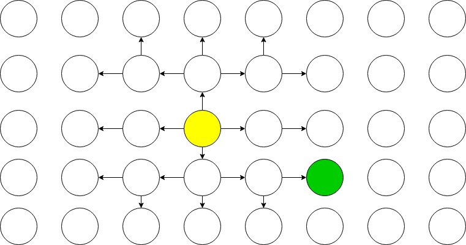

import SlidingPuzzle from './SlidingPuzzle/SlidingPuzzle';

একটি স্লাইডিং পাজলে সাধারণত মোট আটটি স্কয়ার আর একটি খালি জায়গা থাকে। খালি জায়গাটির অবস্থান পরিবর্তন করে পাজলটিকে এলোমেলো করা যায়, আবার সমাধানও করা যায়। আমরা কোড করে এই পাজলটিকে সমাধন করার চেষ্টা করব।

খালি জয়গা সহ নয়টি স্কয়ারের মোট ৯! = ৩৬২৮৮০ রকম কনফিগারেশন হতে পারে। যার মধ্যে একটি কনফিগারেশন সমাধান। আমাদের কাজ হবে যেকোন এলোমেলো কনফিগারেশন থেকে সেই সমাধান কনফিগারেশনে কিভাবে যেতে হবে বের করা।

আমরা সমস্যাটিকে একটি গ্রাফ হিসেবে বিবেচনা করব। যেখানে প্রতিটি কনফিগারেশন হল একেকটি নোড। আার ঐ কনফিগারেশন থেকে যে সব কনফিগারেশনে যাওয়া যায় সেগুলো হল ঐ নোডের নেইবার। প্রতিটি নোডকে আমরা ০ থেকে ৯ সংখ্যাগুলোর একটি অ্যারে দিয়ে রিপ্রেজেন্ট করব।

এখনে ব্যবহার করা অ্যালগরিদমগুলোর মূল প্রক্রিয়া একই। আমরা শুরুর এলোমেলো নোডটি `toCheck` এ রাখব। আর যে নোডগুলো অলরেডি চেক করা হয়েছে সেগুলো রাখার জন্য `checked` একটি সেট নেব। তারপর `toCheck` থেকে একেকটি নোড নিয়ে চেক করতে থাকব। যদি দেখা যায় নোডটি সমাধান নোড তহলে এই নোডে আসার স্টেপগুলোই আমাদের সমাধান। আর যদি না হয় তাহলে ঐ নোডের আশেপাশের নোডগুলো বের করে `toCheck` এ রাখব (যদি সেটা `checked` এ না থাকে) এবং `checked` এ চেক করা নোডটি রেখে দেব। যতক্ষণ না সমাধান পাওয়া যায় এভাবে চালিয়ে যাব।

### ডিএফএস

DFS এ `toCheck` এর জন্য একটি [স্ট্যাক](https://www.geeksforgeeks.org/stack-data-structure/) ব্যবহার করতে হবে।

```js
class Node {
  constructor(config, prev = null, move = null) {
    this.config = config;
    this.move = move;
    this.prev = prev;
  }

  solved() {...
  }
  neighbors() {...
  }
  getMoves() {...
  }
}

function dfs(node) {
  const toCheck = [node];
  const checked = new Set();

  while (toCheck.length > 0) {
    const currentNode = toCheck.pop();

    if (currentNode.solved()) {
      return currentNode.getMoves();
    }

    checked.add(currentNode.str);

    for (const node of currentNode.neighbors()) {
      if (!checked.has(node.str)) {
        toCheck.push(node);
      }
    }
  }
}
```

ট্রাই করুন: (অ্যারো কি ব্যাবহার করে এলোমেলো করতে পারেন)

<SlidingPuzzle methods={['dfs']} id="#1" />

কাজ চলে। শুধু ছ‌োট্ট একটি সমস্যা হল → → ↓ দিয়ে এলোমেলো করা হলে প্রায় এক লক্ষেরও বেশি স্টেপওয়ালা সমাধান বের হয়! যেখানে মাত্র তিন স্টেপেই সমাধান হওয়ার কথা।

এমনটা কেন হচ্ছে? কারণ DFS বা 'ডেপথ্ ফার্স্ট সার্চ' এর মানেই হল গ্রাফের সবচেয়ে গভীরে আগে খুঁজবে। ব্যাপারটা অনেকটা এমন হচ্ছে:



### বিএফএস

তারপর আসা যাক BFS এ। আমরা জানি BFS একটি শর্টেস্ট পাথ অ্যালগরিদম। DFS এর সাথে এর পার্থক্য হল শুধু স্ট্যাকের বদলে [কিউ](https://www.geeksforgeeks.org/queue-data-structure/) ব্যবহার করতে হয়। এতে করে গ্রাফের গভীরে যাওয়ার আগে কাছের নোডগুলো আগে ভিজিট হয়। (জাভাস্ক্রিপ্টে স্ট্যাক, কিউ দুটোর কাজই অ্যারে দিয়ে চালানো যায়। `js।.pop()` করলে শেষের উপাদান পওয়া যায় আর `js।.shift()` করলে সামনের)

```js
function bfs(node) {
  const toCheck = [node];
  const checked = new Set();

  while (toCheck.length > 0) {
    const currentNode = toCheck.shift();

    if (currentNode.solved()) {
      return currentNode.getMoves();
    }

    checked.add(currentNode.str);

    for (const node of currentNode.neighbors()) {
      if (!checked.has(node.str)) {
        toCheck.push(node);
      }
    }
  }
}
```

<SlidingPuzzle methods={['dfs', 'bfs']} id="#2" />

কয়েকবার `Jumble` করে `dfs()` ও `bfs()` করে দেখুন। বিএফএস যে শুধু শর্টেস্ট পাথ দেয় তা না, সময়ও বেশ কম লাগে। চমৎকার। তাই না? মনে হতে পারে BFS DFS কে _'অক্করে হুতাই লাইসে'_। তাহলে এই কনফিগারেশনটি ট্রাই করুন:

<SlidingPuzzle
  methods={['dfs', 'bfs']}
  givenState={[1, 0, 6, 8, 3, 4, 2, 7, 5]}
  id="#3"
/>

কি দেখলেন? DFS থেকে BFS বেশ কয়েকগুন বেশি সময় নেয়। কেন? কারণ শুরুর নোডটি একটু বেশি এলোমেলো হলে বিএফএস এর অবস্থা টাইট হয়ে যায়। কাছের নোডগুলো আগে চেক করতে গিয়ে ফইনাল নোড যত গভীরে আছে সেই গভীরতা পর্যন্ত সকল নোড চেক করতে হয়। এজন্য কনফিগারেশনটি একটু বেশি এলোমেলো হলে আর্থাৎ সলিউশন নোড খুব দূরে হলে বিশাল সংখ্যক নোড চেক করতে হয়। এতে সময় যেমন বেশি লাগে আবার চেক করা নোডগুলো হিসেব রাখতে মেমরিও বেশি লাগে।

(কিছু কিছু ডিভাইসে এই কনফিগারেশনটির জন্যও BFS DFS থেকে ভাল পারফর্ম করতে পারে। সেক্ষেত্রে আরো চার-পাঁচবার `jumble` ক্লিক করে এলোমেলো করে ট্রাই করুন।)



চিত্রে দেখতে পাচ্ছে সলিউশন নোডের দূরত্ব শুরুর নোড থেকে ৩। BFS এর ক্ষেত্রে তিন দূরত্বের সকল নোড চেক করতে হবে। বুঝতেই পারছেন দূরত্ব বাড়ার সাথে সাথে চেক করা নোডের সংখ্যা খুব দ্রুত বাড়বে।

### A\* সার্চ

এখানে দুটো অ্যাপ্রোচের সমস্যা মুটামুটি একই। কোন নোডগুলো আগে চেক করতে হবে ঠিক করতে না পারা। কাছেরগুলো আগে চেক করলে অনেকগুলো চেক করতে হয়। আর গভীরেরগুলো আগে চেক করলে কাছের সলিউশন ফসকে যায়। কোন নোডগুলো আগে চেক করতে হবে সেটা যদি শুধু একটু বুদ্ধি করে ঠিক করা যেত!

আমরা যা করব তা হল প্রতিটি নোডের একটি কস্ট হিসেব করব। তারপর তারপর `toCheck` এর জন্য স্ট্যাক কিংবা কিউ ব্যবহার না করে [প্রায়োরিটি কিউ](https://en.wikipedia.org/wiki/Priority_queue) ব্যবহার করব। তহলে সবচেয়ে কম কস্টওয়ালা নোডগুলো আগে চেক হবে।

একটি নোডের কস্ট কিভাবে হিসেব করা যায়? নোডটি থেকে সলিউশন নোডের দূরত্ব আর শুরুর নোডের দূরত্বের যোগফল একটি কস্ট হতে পারে। অবশ্যই, নোডটি সলিউশন নোড থেকে কতটা দূরে আছে সেটা কারেক্টলি বের করার কোন সহজ উপায় নেই। আমরা মুটামুটি আনুমানিক একটি দূরত্ব নিতে পারি। যেমন এই ফাংশনটি ব্যাবহার করা যায়:

```js
function dist(config) {
  return config.reduce((prev, cur, i) => {
    cur = (cur || 9) - 1;
    return (
      prev + Math.abs((cur % 3) - (i % 3)) + Math.abs(~~(cur / 3) + ~~(i / 3))
    );
  }, 0);
}
```

কোড বুঝতে আসুবিধা হলে চিন্তার কিছু নেই। ফাংশনটি প্রতিটি স্কয়ার তার প্রত্যাশিত অবস্থান থেকে কতটা দূরে আছে সেটার যোগফল দেয়। আর এখানে স্কয়ারের দূরত্বের জন্য সাধারণ [ইউক্লিডিয়ান দূরত্ব](https://en.wikipedia.org/wiki/Euclidean_distance) ব্যবহার না করে আরো সিম্পল ফর্মুলা ব্যবহার করা হয়েছে। জাস্ট x ও y অক্ষে পার্থক্যের যোগফল। একে [ম্যানহ্যাটন ডিসট্যান্স](https://www.quora.com/What-is-Manhattan-Distance) বলে।

এমন আনুমানিক কস্টকে [হিউরিস্টিক](<https://en.wikipedia.org/wiki/Heuristic_(computer_science)>) বলা হয়ে থাকে। আর A\* সার্চ হল একটি হিউরিস্টিক সার্চ অ্যালগরিদম। সব ধরণের গ্রাফে হয়ত এটি ব্যবহার করা যাবে না। কারণ অনেক কোন রকম হিউরিস্টিক হিসেব করার কোন সুযোগ নেই।

নোড ক্লাসে কিছু পরিবর্তনসহ এই হল A\* কোড: (প্রায়োরিটি কিউ [এখান](https://github.com/mourner/tinyqueue/blob/master/index.js) থেকে নেয়া হয়েছে)

```js
class Node {
  constructor(config, prev = null, move = null, depth = 0) {
    this.config = config;
    this.str = config.join();
    this.move = move;
    this.prev = prev;

    this.depth = depth;
    this.cost = depth + dist(config);
  }
  ...
}


function ast(node) {
  const toCheck = new PriorityQueue([node], (a, b) => a.cost - b.cost);
  const checked = new Set();

  while (toCheck.length > 0) {
    const currentNode = toCheck.pop();

    if (currentNode.solved()) {
      return currentNode.getMoves();
    }

    checked.add(currentNode.str);

    for (const node of currentNode.neighbors()) {
      if (!checked.has(node.str)) {
        toCheck.push(node);
      }
    }
  }
}
```

<SlidingPuzzle
  methods={['dfs', 'bfs', 'ast']}
  givenState={[1, 0, 6, 8, 3, 4, 2, 7, 5]}
  id="#4"
/>

সম্পূর্ণ কোড [এখানে](https://github.com/sjsakib/blog/tree/master/src/posts/may-2019/SlidingPuzzle) পাবেন। শুধু সলিউশনের কোডের জন্য [এই ফাইলটি](https://github.com/sjsakib/blog/blob/master/src/posts/may-2019/SlidingPuzzle/solve.js) দেখুন। যদি ভাল লেগে থাকে তাহলে উপরে ডানে স্টার বাটনটি একটু চেপে দিলে ভাল লাগবে ☺

### তারপর?

তারপর এই কোডগুলো ওয়েব অ্যাসেম্বলিতে কম্পাইল করে দেখার ইচ্ছা আছে। টাইপস্ক্রিপ্ট থেকে [ওয়েব অ্যাসেম্বলিতে](https://developer.mozilla.org/en-US/docs/WebAssembly) কনভার্ট করার [একটি টুল](https://assemblyscript.org/) দেখলাম কিছুদিন আগে। সফল হলে অবশ্যই লেখার চেষ্টা করব।

আর এখানে প্রত্যেকটি সলিউশনই কিন্তু একটি [ওয়েব ওয়ার্কারে](https://developer.mozilla.org/en-US/docs/Web/API/Web_Workers_API) রান করা হয়েছে। নাহলে প্রতিটি অ্যালগরিদমই ব্রাউজার উইন্ডো ফ্রিজ করে দিত। ওয়েব ওয়ার্কার নিয়েও লেখার ইচ্ছা আছে।
