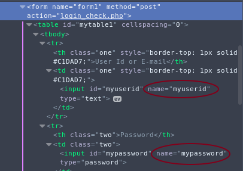

I've solved a number of problems in LightOJ. But never felt the necessity of saving the codes. I thought they are always available there, I can grab them anytime. But now that I've discovered showing off codes in github is a super cool thing, what do I do? Go to LightOJ and copy and paste all the AC codes? :astonished:

Luckily I know a little python and there is a great framework called scrapy to scrap things using python. I never used scrapy before though.

First I headed to the scrapy docs and had a look at the [tutorial](https://doc.scrapy.org/en/latest/intro/tutorial.html). After spending some time there, I got a rough idea how it works. Time to learn by doing. Our target is to scrape all the `Accepted` submissions from LightOJ and to save them in their category folders. 

Let's start a project with this command
```
$ scrapy startproject loj
```

It gives us a project structure like this
```
.
├── lightoj
│   ├── __init__.py
│   ├── items.py
│   ├── middlewares.py
│   ├── pipelines.py
│   ├── __pycache__
│   ├── settings.py
│   └── spiders
│       ├── __init__.py
│       └── __pycache__
└── scrapy.cfg
```

It's spiders we need to write to scrape LightOJ for us. We'll create our spider with this command
```
$ cd lightoj
$ scrapy genspider loj lightoj.com
```
It'll create a spider with name `loj` for the site  `lightoj.com` in the `spiders` folder. This is how it looks now
```python
# -*- coding: utf-8 -*-
import scrapy


class LojSpider(scrapy.Spider):
    name = 'loj'
    allowed_domains = ['lightoj.com']
    start_urls = ['http://lightoj.com/']

    def parse(self, response):
        pass
```

The `start_urls` are the urls from where the spider start crawling. Scrapy first gets these pages for us and calls the `parse` method with the returned content so that we can do whatever we want with them. For now the `parse` method does nothing.

Here we are trying to get all our submissions. So we'll want our first page to be `http://lightoj.com/volume_usersubmissions.php` as this is where the submissions are listed. But we have to be logged in to access this page. If we try to access this page LightOJ will redirect us to the page `login_main.php` to log in. So we'll start right from this page. Let's set the `start_urls`
```python
start_urls = ['http://lightoj.com/login_main.php']
```
Now we'll define what we want to do in our first page in the `parse` method of our spider. We'll submit the login form in this page. Scrapy has support for login forms. For that we have to know the login form field names. We can obtain this using firefox developer tools. So we'll go to lightoj.com and log out if necessary. Then right click the form and select `Inspect Element`.  That's how the form looks in firefox dev tool.



Now we know the fields are `myuserid` and `mypassword`. Now we can submit them. We'll save user id and password in settings file. Let's add this to our `settings.py` file
```python
USER = 'sjsakib.bd@gmail.com'
PASS = os.environ['LOJPASS']
```
(I've replaced password with environment variable here. It's not necessary. Plain password could be put.)

Now let's update the `parse` method
```python
def parse(self, response):
    return scrapy.FormRequest.from_response(
        response,
        formdata={'myuserid': self.settings.get('USER'),
                  'mypassword': self.settings.get('PASS')},
        callback=self.after_login
    )
```
Here `self.after_login` is a method of our spider where we'll define what to do after login. If login fails, LightOJ will redirect us again to the `login_main.php` page. LightOJ redirects in a strange way. It returns a script like ```<script>location.href='login_main.php'</script>```. So if we find `login_main.php` in the response text, it will mean login failed and our spider have to stop there. Otherwise, we can assume that login was successful and we can continue our scraping. Our next page have to be the `volume_usersubmissions.php` page. We'll add link of this page in our spider class to use later. 
```python
class LojSpider(scrapy.Spider):
    #....
    my_sub_url = 'http://lightoj.com/volume_usersubmissions.php'
    #...
```

We'll tell scrapy which page to scrape next by `yield`ing a `scrapy.Request` object. First argument is the next url and the second is a callback method to handle the response. 
```python
def after_login(self, response):
    if 'login_main.php' in response.text:
        self.logger.error("Login failed...")
        return
    self.logger.info("Log in successful...")
    yield scrapy.Request(self.my_sub_url, callback=self.my_sub)
```

This page doesn't contain all the submissions either. We'll have to submit another form for all the submissions. The password field name in this page is `user_password`. So let's submit our password once again in the `my_sub` method
```python
def my_sub(self, response):
    return scrapy.FormRequest.from_response(
        response,
        formdata={'user_password': self.settings.get('PASS')},
        callback=self.parse_allsub
    )
```

In the response page we'll have all the submissions. We'll define the method `parse_all_sub` to process them. All the submissions in that page is in a table with id `mytable3`. In every row there's link to a submission in a `<th>` tag. The verdict is in a `<div>` tag in the last cell. We'll use `response.css` to select them and see if the verdict is `Accepted`. Then we'll follow the submission link to get our code.
```python
def parse_allsub(self, response):
    trs = response.css('#mytable3 tr')  # getting all the rows
    for tr in trs[1:]:  # skipping header row
        ver = tr.css('div::text').extract_first().strip()  # getting verdict text
        a = tr.css('a')[0]  # link to the submission
        if ver == 'Accepted':
            yield response.follow(a, callback=self.parse_sub)
```

Now we'll parse each submission in the `self.parse_sub` method. Our code is in a `<textarea>` element. We'll extract our code and other informations about the submission. 

Now we've got a problem. The default html parser of scrapy treats our code as html and messes up everything. If we try to select the textarea and extract our code like this
```python
code = response.css('textarea::text').extract_first()
print(code) 
```
We get only `#include `. Where's the rest of code? What's happening here? :worried: Notice that next word in the code after this is `<bits/stdc++.h>`. Scrapy is treating this as a html tag. So we get only `#include ` as text. We can't extract our code with the html parse that comes with scrapy :neutral_face:

We'll use `BeautifulSoup` instead. (Which I've used earlier) It's easy, we'll import `BeautifulSoup` and create our soup with `response.text`. Then we can extract all our informations correctly.

```python
def parse_sub(self, response):
    soup = BeautifulSoup(response.text, 'html5lib')
    
    # getting our code
    code = soup.find('textarea').text
    
    # getting other informations
    tr = soup.find('table', id='mytable3').find_all('tr')[1]
    tds = tr.find_all('td')
    subid = tr.find('th').text.strip()
    date = tds[0].text.strip()
    name = tds[2].text.strip()
    lang = tds[3].text.strip()
    cpu = tds[4].text.strip()
    mem = tds[5].text.strip()
    pid = name.split('-')[0].strip()

    self.logger.info('yielding code for problem {}'.format(pid))

    yield {
        'name': name,
        'pid': pid,
        'subid': subid,
        'date': date,
        'lang': lang,
        'cpu': cpu,
        'mem': mem,
        'code': code,
    }

    # To get problem tags
    forum_page = self.forum_url+pid
    request = scrapy.Request(forum_page, callback=self.parse_rdr)
    request.meta['pid'] = pid
    yield request
```

Now the problem tags are not in this page. But we want to save all the codes in their category folder. To get the categories of the problem, we have to follow another page, the forum page of the problem. Again LightOJ will redirect us in the strange way. We'll handle that.
```python
def parse_rdr(self, response):
    # getting the redirect url from the script
    href = 'http://lightoj.com/' + response.text.split("'")[1]
    request = scrapy.Request(href, self.parse_forum)
    request.meta['pid'] = response.meta['pid']
    yield request

def parse_forum(self, response):
    tb = response.css('#mytable3')[1]
    div = tb.css('tr th div')[1]
    tags = div.css('a::text').extract()
    pid = response.meta['pid']
    self.logger.info('yielding tags of {}'.format(pid))

    yield {
        'pid': pid,
        'tags': tags
    }
```

A lot of coding. Time  to unleash :fire: our spider and see how much it works. [Here's](https://gist.github.com/sjsakib/b11a18ffcd74e65915ff3d38f01b01fd) how the code looks so far.
```
$ scrapy crawl loj -o data.json
```

If we open the `data.josn` file, we'll see that our spider has done its work :grinning:
```json
....
{"code": "import java.io.BufferedReader;\nimport ..... System.out.printf(\"Case %d: %d\\n\",i+1,s);\n\t\t}\n\t}\n}\n", "cpu": "0.456", "mem": "29864", "subid": "524108", "date": "2015-05-30 05:07:18", "name": "1015 - Brush (I)", "lang": "JAVA", "pid": "1015"}
....
{"tags": ["Beginners Problems", "Number Theory"], "pid": "1045"}
....
```
It has saved the codes along with other informations and also which problems have what tags. It's cool, no? It's all the data we need. But we can't upload these to github and show all our coolness. They need to be saved in organized folders. We'll do so in the next part.